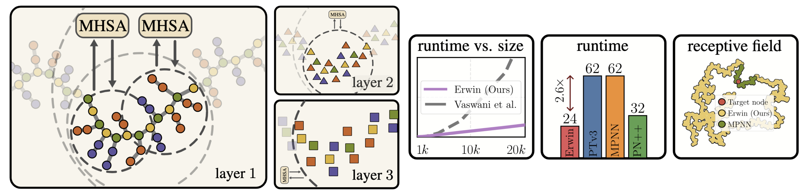
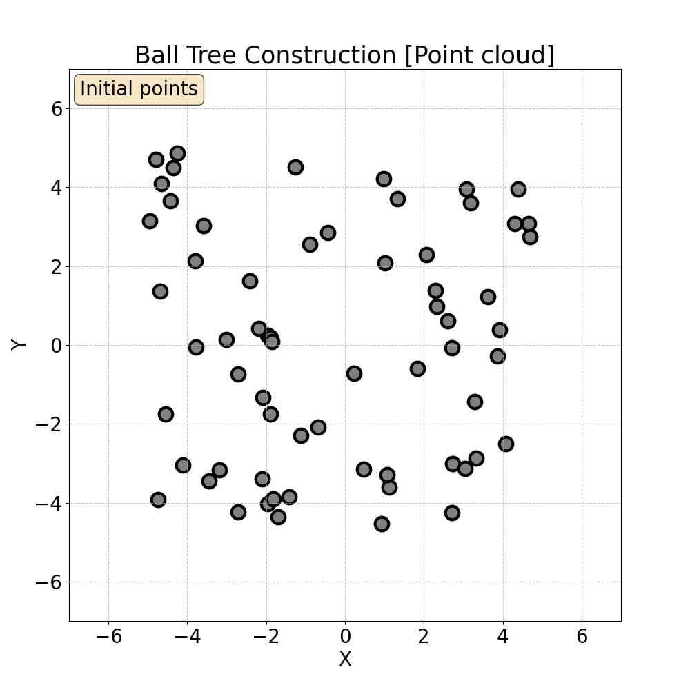
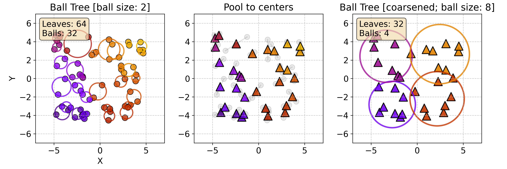
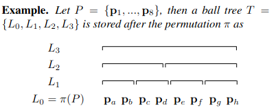
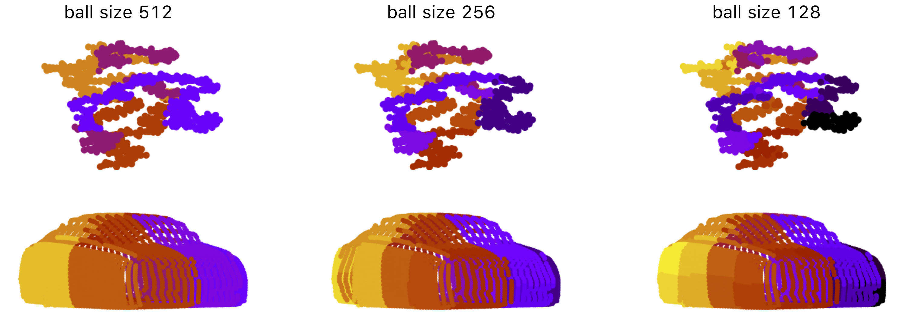

# Erwin Transformer

<p align="center">
    <a href="https://arxiv.org/abs/2502.17019"><strong>Erwin: A Tree-based Hierarchical Transformer for Large-scale Physical Systems</strong></a><br/>
    <a href="https://maxxxzdn.github.io/">Max Zhdanov</a>, Max Welling, Jan-Willem van de Meent
    <br/>
    <br/>
    
</p>

## Trivia

### Ball Tree
A **ball tree** is a hierarchical data structure that recursively partitions points into nested sets of similar size, where each set is represented by a ball that covers all the points in the set. The input is a point cloud, and the tree is built recursively:
<p align="center">
    
</p>

### Ball Tree Attention
The main idea of the paper is to compute attention within the ball tree partitions. Once the tree is built, one can choose the level of the tree and compute attention (**Ball Tree Attention**, BTA) within the balls in parallel:
<p align="center">
    
</p>

### Hierarchical structure
Since Ball Tree Attention is localized, we progressively coarsen and then refine the ball tree to aggregate global information following a U-Net-like structure of the model::
<p align="center">
    
</p>
After each coarsening, Ball Tree Attention is computed. By keeping the balls of fixed size, the receptive fields grow as balls now cover a larger area.

### Computational efficiency
The ball tree is stored in memory contiguously - at each level of the tree, points in the same ball are stored next to each other:
<p align="center">
    
</p>

This property is critical and allows us to implement key operations described above simply via `.view` or `.mean`:
```python
# partitioning into balls before attention
x_partitioned = x.view(-1, ball_size, dim)

# coarsening a tree: pooling inner points to the center
pos_coarsened = pos.view(-1, ball_size, dim).mean(1)

# use learnable pooling to pool features
pooling_fn = nn.Linear(dim * ball_size, dim)
x_corasened = pooling_fn(x.view(-1, ball_size * dim)) # (-1, dim)
```
### Examples of ball trees
Below are examples of ball trees that we built in our experiments - polypeptides in molecular dynamics and cars in ShapeNet-Car:
<p align="center">
    
</p>

## Using Erwin

Erwin expects as inputs:
 - `node_features`: a ragged array of node features, shape: [num_points, num_features]
 - `node_positions`: a ragged array of node positions, shape: [num_points, num_dimensions]
 - `batch_idx`: batch assignment for each node, shape: [num_points] (e.g. [0, 0, 1, 1, 1, 2, 2, ...])
 - `edge_index`: (optionally) connectivity of shape [2, num_edges]
 - `radius`: (optionally) float radius to build radius connectivity (used when edge_index is not given)

```python
import torch
from models import ErwinTransformer

config = {
    'c_in': 32,
    'c_hidden': 32,
    'enc_num_heads': [2, 4, 8, 16, 32],
    'enc_depths': [2, 2, 2, 6, 2],
    'dec_num_heads': [4, 4, 8, 16],
    'dec_depths': [2, 2, 2, 2],
    'strides': [2, 2, 2, 2],
    'ball_size': [128, 128, 128, 128, 128],
    'dimensionality': 3, # 3D space
}

model = ErwinTransformer(**config).cuda()

bs = 16
num_points = 2048

node_features = torch.randn(num_points * bs, 32).cuda()
node_positions = torch.rand(num_points * bs, 3).cuda()
batch_idx = torch.repeat_interleave(torch.arange(bs), num_points).cuda()
radius = 0.05 # build radius connectivity if not given otherwise

out = model(node_features, node_positions, batch_idx, radius=radius)
```

### Erwin is fast
Due to the simplicity of implementation, Erwin is *blazing fast*. Below is the benchmark for the given configuration with batch size 16 and a varied number of points in each point cloud in the batch. On a single NVIDIA RTX A6000 (48 GB):

| nodes per point cloud | 1024   | 2048 | 4096 | 8192 | 16384 | 32768 |
| :------------   | :--------: | :-----:  | :-----:  | :-----:  | :----:    | :--------: |
| Forward | 15.2 ms | 17.3 ms | 31.6 ms | 79.7 ms| 189 ms | 459 ms |
| Forward + Backward | 55.0 ms | 65.4 ms | 113.9 ms | 267.1 ms| 646.7 ms | OOM |

### Erwin has a minimal set of dependencies

Erwin has a minimal number of dependencies:
- PyTorch
- einops
- Cython
- torch-cluster (optional, is used to build a graph in the Embedding module)

A virtual environment named `erwin` can be created using `uv`
and activated with:
```
bash setup.sh
```

If you only want to play with Erwin and don't want to install additional dependencies (tensorflow, spconv, etc.) use
```
bash setup.sh --minimal
```

to install `uv` run:
```
curl -LsSf https://astral.sh/uv/install.sh | sh
```

## Ball tree implementation in C++

We provide a fast, parallelized implementation of Ball Trees in C++ and Cython.
The code is optimized for batched data coming in the form of a ragged array.

### Usage

```python
import numpy as np
from balltree import build_balltree, build_balltree_torch

batch_size, num_points = 16, 8000

# NumPy
points = np.random.rand(num_points * bs, 2).astype(np.float32)
batch_idx = np.repeat(np.arange(bs), num_points)
tree_idx, tree_mask = build_balltree(points, batch_idx)

# PyTorch
points = torch.rand(num_points * bs, 2, dtype=torch.float32, device='cuda')
batch_idx = torch.repeat_interleave(torch.arange(bs, device='cuda'), num_points)
tree_idx, tree_mask = build_balltree_torch(points, batch_idx) # Returns tensors on the same device
```

### Benchmark
We compare the runtime of our implementation against the [`scikit-learn` implementation](https://scikit-learn.org/stable/modules/generated/sklearn.neighbors.BallTree.html) + `joblib`. In each experiment, batch size is set to 16 and each element of the batch has a fixed number of nodes (columns of the table). Computed on 16 AMD EPYC™ 7543 CPUs.

| Implementation  | 1k nodes   | 2k nodes | 4k nodes | 8k nodes | 16k nodes |
| :------------   | :--------: | :-----:  | :-----:  | :-----:  | :----:    |
| sklearn + joblib|15.6 ms|16.3 ms|21.2 ms|24.1 ms|44.0 ms|
| Ours            |0.32 ms|0.73 ms|1.54 ms|3.26 ms|6.98 ms|
| Speed-up        |48.8×  |22.3×  |13.8×  |7.4×   |6.3×   |

### Requirements
- C++ compiler with C++11 support
- Python 3.6+
- Cython
- NumPy


## Replicating experiments  

### Experimental Data

To run/replicate experiments, you will need to download:
- [Cosmology dataset](https://zenodo.org/records/11479419) (7 GB)
- [Single-chain polymet dataset](https://zenodo.org/records/6764836) (13 GB)
- [EAGLE dataset](https://datasets.liris.cnrs.fr/eagle-version1) (270 GB)
- [ShapeNet-Car dataset](https://github.com/ml-jku/UPT/blob/main/SETUP_DATA.md) (2 GB) 


### Experiments

Training scripts are given in [experiments](experiments). For example, to train on the molecular dynamics task:
```
cd experiments
python train_md.py --use-wandb 1 --size medium --model erwin
```

## BibTeX
```
@misc{zhdanov2025erwintreebasedhierarchicaltransformer,
      title={Erwin: A Tree-based Hierarchical Transformer for Large-scale Physical Systems}, 
      author={Maksim Zhdanov and Max Welling and Jan-Willem van de Meent},
      year={2025},
      eprint={2502.17019},
      archivePrefix={arXiv},
      primaryClass={cs.LG},
      url={https://arxiv.org/abs/2502.17019}, 
}
```