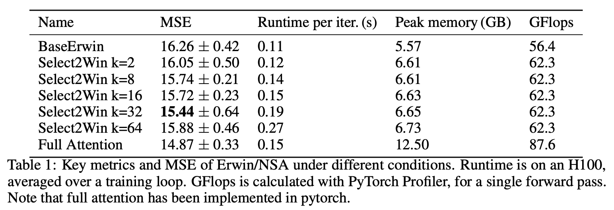
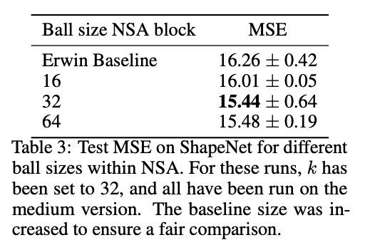

# Select2Win and the Erwin Transformer
In this github repository, we extend the [Erwin Transformer](https://github.com/maxxxzdn/erwin) to include [Native Sparse Attention](https://arxiv.org/abs/2502.11089) using the [Lucidrains implementation](https://github.com/lucidrains/native-sparse-attention-pytorch).

## Introduction and problem statement

### Erwin
Erwin is a hierarchical tree-based method that processes the point cloud at multiple levels of granularity using a U-net structure.
To linearize attention computation, Erwin restricts the computation of attention to sub partitions of the total space. Information propagates via two ways: compression up the ball tree, and a rotating window technique, similar to the [Swin Transformer](https://arxiv.org/abs/2103.14030).

### Problem statement and contribution
Although interaction with balls closeby is ensured by the tree-like structure Erwin provides, interaction between distant nodes remains limited, as compression up the ball tree causes a loss of native fidelity, and rotation requires many iterations for distant points to interact.
This becomes especially problematic in datasets where long range interactions are critical for data processing, such as in airflow pressure modeling. [Native sparse attention (NSA)](https://arxiv.org/abs/2502.11089) introduces a selection mechanism where tokens are filtered in a block-based pattern before attention is computed, providing a method by which important long range detail is included without relying on full attention. In this work, we introduce Select2Win, a method to combine NSA into the Erwin transformer architecture, and report increased performance on a variety of datasets while keeping Erwin's computational efficiency.

.png)

## Related work
### Attention for Point Clouds
Adding structure to a point cloud in order to reduce the computational complexity of self-attention is a common approach for attention-based methods.
[The Point Transformer V3](https://arxiv.org/abs/2312.10035) and [FlatFormer](https://arxiv.org/abs/2301.08739) first order the point cloud sequentially, while other methods create patches covering the point cloud, such as the [OctFormer](https://doi.org/10.1145/3592131), the [patchformer](10.1109/CVPR52688.2022.01150) and the [Erwin Transformer](https://arxiv.org/abs/2502.17019).
The [Octree Transformer](https://doi.org/10.1145/3592131) and the [Erwin Transformer](https://arxiv.org/abs/2502.17019) create point cloud patches using an Octree and a ball tree, respectively.
The Erwin Transformer is more efficient than the other approaches due to the efficient use of the ball tree structure.
Even though Erwin's rotation mechanism improves the interaction between points in neighboring balls, interaction between distant points requires coarsening and refinement of the ball tree.

## Select2Win

We propose Select2Win, a modified version of Erwin with an additional NSA layer added at the beginning. This added NSA layer imitates the compression and selection mechanism present in NSA. Compression and selection of the top k blocks is done over balls of points, rather then over blocks of text tokens. Likewise, selection is done for each Each query point attends to the key points in the selected balls for that point.
Note that its own ball cannot be selected, to ensure the model learns actual long-range interactions.
Sliding window attention was left out, as the original Erwin structure already accounts for the local window of a point.

## Results
To highlight the performance of our model, we run it on the Shapenet car dataset as well as the cosmological dataset.

### ShapeNet-Car

#### Different top-k values and memory usage
Table 1 shows the MSE over different versions of Select2Win, as well as baseline Erwin and full NSA. We see that as more compressed blocks get selected, the MSE improves, showcasing the need for improved long range interactions. The best performance is reached at k=32, most likely since selecting less blocks leads to too little information. We hypothesize selecting more blocks limits the models ability to learn which blocks are relevant. Full NSA outperforms all Select2Win architectures, since it obtains all relevant information.

We also detail the performance of our various algorithms and the baseline Erwin comparison on the Shapenet dataset in. Please note that the full attention method has been implemented in pytorch only, explaining the peak in memory usage. We see that adding the NSA block results in a minimal increase on the runtime when a small amount of blocks are chosen. More noticeably, adding the NSA block hardly affects the FLOPs rate and memory usage, showcasing that adding NSA to Erwin does keep the peak memory consistent.

#### Different ball sizes

Table 3 shows the effect of increasing the ball size of the NSA layer. We see that the larger ball sizes result in lower MSEs. This highlights that NSA learns to select certain areas of the car to focus attention on: larger selection sizes allow the model to do fine-grained attention on one entire area of the car, for instance the front, instead of a smaller subset of that area. The results also confirm that as the size of balls to compute fine attention over increases, the MSE decreases, highlighting the effectiveness of NSA once more.

### Cosmology

Tables 4 and 5 show results of both Erwin reproduction and Select2Win on the cosmology dataset.
The differences between Select2Win, Erwin and prepending a full attention block are marginal, which may suggest that adding edges in the attention graph may not be noticeably beneficial for this task.

## Reproducing Select2Win results
To reproduce the results, the datasets must be downloaded and the environment must be installed. After that, either the jobfiles or the python scripts can be used to reproduce our results.

### Datasets
The following datasets should be downloaded to reproduce our results:
- [Cosmology dataset](https://zenodo.org/records/11479419) (7 GB)
- [ShapeNet-Car dataset](https://github.com/ml-jku/UPT/blob/main/SETUP_DATA.md) (2 GB)

### Environment
To install the environment, run the `setup.sh` script.

### Experiments
The job files used to obtain the results are given in [snellius_run_scripts](snellius_run_scripts), and use the scripts given in [experiments](experiments).

To train a model on the shapenet-car dataset, for example the test for the k=32 results either run:
```
cd experiments
python train_shapenet.py --num-epochs 40000 --lr 1e-3 --use-wandb --test \
 --data-path $PATH_TO_SHAPENET \
 --nsa-type NSAMSA --nsa-loc begin --topk 32 --size medium --experiment k32
```
or
```
sbatch snellius_run_scripts/shapenet_k32.job
```

To reproduce the baseline Erwin experiments on shapenet, run:
```
uv run train_shapenet.py --num-epochs 40000 --lr 1e-3 --use-wandb --test \
 --data-path "/scratch-shared/scur2588/data/mlcfd_data/preprocessed" \
 --size medium+ --experiment baseline_136
```

To reproduce the full attention results on shapenet, run:
```
uv run train_shapenet.py --num-epochs 40000 --lr 1e-3 --use-wandb --test \
 --data-path "/scratch-shared/scur2588/data/mlcfd_data/preprocessed" \
 --nsa-type FullAttention --nsa-loc begin --size medium  --experiment full_attention
```

To train a model on the cosmology dataset, either run:
```
python train_cosmology.py \
    --data-path ../cosmology_data \
    --size small \
    --num-samples 2048 \
    --batch-size 16 \
    --num-epochs 3000 \
    --msa-type BallMSA \
    --experiment base \
```
or
```
sbatch snellius_run_scripts/run_cosmo.job
```

Although default Erwin/Select2Win configurations are provided in the python scripts, it is possible to create a custom config, such as in experiments/configs. This config can be passed by adding the path to the config file as via the `--config` flag.

### Profiling Select2Win
To run the profiler, use the following commands:

Base Erwin:
```
python profile_forward_pass.py --size medium --num-epochs 1 --data-path "shapenet_car/preprocessed" --msa-type BallMSA --batch-size 1
```
NSA with topk = 2
```
python profile_forward_pass.py --size medium --num-epochs 1 --data-path "shapenet_car/preprocessed" --msa-type BallMSA --batch-size 1 --nsa-type NSAMSA --topk 2
```
Full Attention layer
```
python profile_forward_pass.py --size medium --num-epochs 1 --data-path "shapenet_car/preprocessed" --msa-type BallMSA --batch-size 1 --nsa-type FullAttention
```

### Creating attention maps
To create attention maps for each head of an NSA layer, use the following steps.
First, extract the attention maps from the checkpoint. You should change the checkpoint path in ```experiments/attn_maps_shapenet.py```. Then, run this file with the same configuration as used for training, but replace ```--nsa-type AccessibleNSAMSA```.

After this scripts finishes, a PyTorch file containing the attention maps can be found in ```experiments/attn_maps```. Run
```
cd visualizations
python attn_maps.py --input-path PATH TO ATTN MAPS FILE
```
to generate the attention maps.


## Contributions

**Please note that all members contributed to all parts of the project: the below division is an overview of what team members contributed most on, but overall, all team members contributed equally to the project.**


Hua Chang Bakker:

- Prototype implementations
- Running experiments on Cosmology
- Creating visualizations, such as the attention maps and receptive field

Madelon Bernardy:

- Running experiments on ShapeNet (ablations and architecture iteration)
- code refactoring to aim to debug third party NSA implementation
- writing sections of (draft and main) report.

  
Dante Campregher:

- Modification and adaptation of third party Triton kernel, including insight on mathematical properties.
- Running experiments on ShapeNet (architecture iteration)
- Code refactoring for merging of team implementations

## Credits
Much of the code in this repository is based on the official code for the [Erwin Transformer](https://github.com/maxxxzdn/erwin) and the [Triton-based implementation of NSA](https://github.com/lucidrains/native-sparse-attention-pytorch) by LucidRains.
